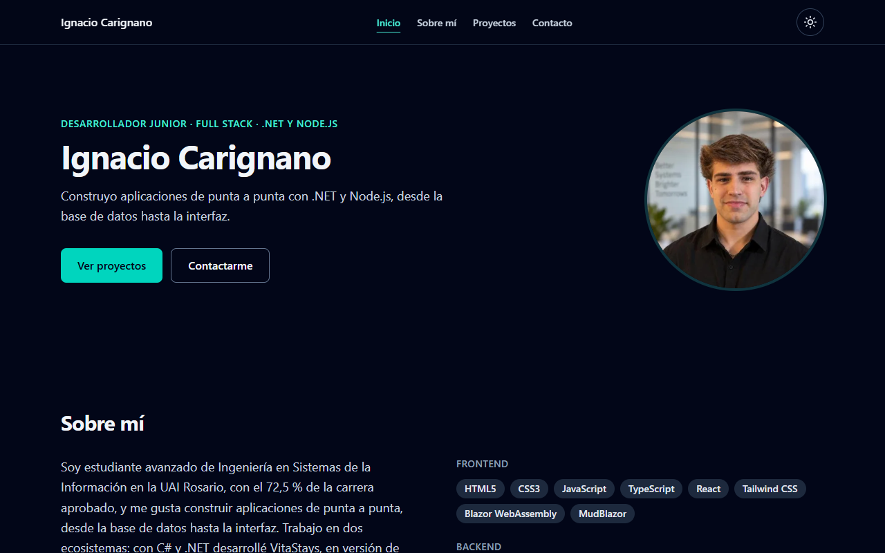
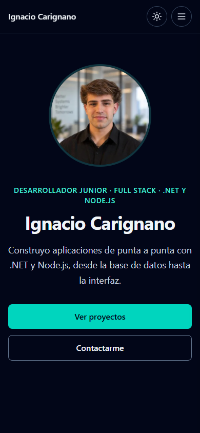

# Portfolio · Ignacio Carignano

Sitio personal para presentar mi perfil como desarrollador: sobre mí, proyectos, CV descargable y formulario de contacto.

**Sitio publicado:** https://i-carignano.github.io/Portfolio/

## Stack

- **React 19** con **TypeScript**
- **Vite** como herramienta de build
- **Tailwind CSS 4** para estilos (modo claro y oscuro)
- **Web3Forms** para el formulario de contacto (sin backend)
- **GitHub Actions** para el deploy en **GitHub Pages**

## Funcionalidades

- Navbar fija: barra superior en desktop y menú lateral en mobile.
- Modo claro y oscuro, con preferencia guardada en el navegador.
- Animaciones sutiles de entrada y hover, desactivadas con `prefers-reduced-motion`.
- Formulario de contacto con validación de campos antes del envío.
- CV descargable en PDF.
- HTML semántico, un solo `h1`, y navegación completa con teclado.
- Menú lateral en mobile con foco atrapado mientras está abierto, y resaltado de la sección activa.

## Estructura

```text
src/
├── components/   # Secciones y componentes de UI (Navbar, Hero, About, Projects, Contact, Footer…)
├── data/         # Contenido: datos personales, habilidades y proyectos
├── hooks/        # useTheme (modo claro/oscuro) y useActiveSection (navbar)
└── lib/          # Validación del formulario de contacto
public/
├── avatar.webp   # Foto de perfil
├── og-image.png  # Imagen para compartir el link
└── cv/           # CV en PDF
docs/             # Capturas del sitio
```

Para cambiar textos, proyectos o links, alcanza con editar `src/data/portfolio.ts`.

## Cómo correrlo localmente

Requisitos: Node.js 22 o superior (el deploy usa Node 24).

```bash
git clone https://github.com/I-Carignano/Portfolio.git
cd Portfolio
npm install
cp .env.example .env.local   # completar VITE_WEB3FORMS_KEY (ver más abajo)
npm run dev
```

El sitio queda disponible en http://localhost:5173/Portfolio/.

Otros comandos:

- `npm run build`: compila a la carpeta `dist/` (incluye chequeo de tipos).
- `npm run preview`: sirve el build generado para revisarlo.

## Formulario de contacto

El formulario envía los mensajes con [Web3Forms](https://web3forms.com/), que no necesita backend.

1. Crear una access key gratuita en web3forms.com con el email de contacto.
2. Ponerla en `.env.local` como `VITE_WEB3FORMS_KEY=...` para correrlo localmente.
3. Para el deploy, guardarla en el repositorio como secreto de GitHub Actions con el nombre `VITE_WEB3FORMS_KEY` (Settings → Secrets and variables → Actions).

Sin esa clave el formulario muestra un mensaje de error y el resto del sitio funciona igual.

## Deploy en GitHub Pages

1. En el repositorio: Settings → Pages → Build and deployment → Source: **GitHub Actions**.
2. Cargar el secreto `VITE_WEB3FORMS_KEY` (ver arriba).
3. Cada push a `main` ejecuta `.github/workflows/deploy.yml` y publica el sitio.

La URL pública es `https://<usuario>.github.io/Portfolio/`. Si cambia el nombre del repositorio, también hay que actualizar `base` en `vite.config.ts`.

## Capturas

| Desktop (1280 px) | Mobile (390 px) |
| --- | --- |
|  |  |

## Requisitos de la consigna

| Requisito | Cómo se cumple |
| --- | --- |
| Hero: nombre, rol, frase y botones de acción | `src/components/Hero.tsx`: botones "Ver proyectos" y "Contactarme" que llevan a su sección |
| Foto o avatar (opcional) | `public/avatar.webp` (WebP 400×400) con `width`, `height` y `alt` |
| Sobre mí: bio y skills por categoría | `src/components/About.tsx`; skills en Frontend, Backend y Herramientas |
| Proyectos: al menos 3, con título, descripción, tecnologías y link | `src/data/portfolio.ts`: cinco proyectos, cada uno con demo o repositorio |
| Contacto: email, GitHub y LinkedIn | `src/components/Contact.tsx` y footer |
| Formulario de contacto validado (opcional) | `src/lib/validation.ts` y `src/components/ContactForm.tsx` |
| Navbar que lleva a cada sección | Barra superior en desktop y menú lateral en mobile (`src/components/Navbar.tsx`) |
| Responsive 360 / 768 / 1280 px sin scroll horizontal | Breakpoints de Tailwind; verificado con Puppeteer en los tres anchos |
| HTML semántico y un solo `h1` | `header`, `nav`, `main`, `section`, `footer`; el único `h1` está en el Hero |
| Accesibilidad básica | `alt` en imágenes, `aria-invalid` y `aria-describedby` en el formulario, foco visible, enlace "Saltar al contenido" y navegación por teclado |
| Sin contenido de relleno | Textos reales en `src/data/portfolio.ts` |
| Commits progresivos | Historial del repositorio, un commit por funcionalidad |
| README con stack y ejecución local | Este archivo |
| Deploy público | GitHub Pages mediante `.github/workflows/deploy.yml` |
| Opcional: modo oscuro y claro | Toggle en la navbar, preferencia guardada al elegirla y `prefers-color-scheme` por defecto |
| Opcional: animaciones con `prefers-reduced-motion` | `src/components/Reveal.tsx` y hover de las tarjetas, desactivados con reduced motion |
| Opcional: CV descargable en PDF | `public/cv/Ignacio-Carignano-CV.pdf` |
| Opcional: Lighthouse ≥ 90 | Ver la sección siguiente |

## Lighthouse

Las medidas se toman sobre la URL publicada, no sobre localhost.

| Categoría | Mobile | Desktop |
| --- | --- | --- |
| Performance | pendiente | pendiente |
| Accessibility | pendiente | pendiente |
| Best Practices | pendiente | pendiente |
| SEO | pendiente | pendiente |

Para medirlas después del deploy:

```bash
npx lighthouse https://i-carignano.github.io/Portfolio/ --preset=desktop --only-categories=performance,accessibility,best-practices,seo --view
npx lighthouse https://i-carignano.github.io/Portfolio/ --form-factor=mobile --only-categories=performance,accessibility,best-practices,seo --view
```

## Autor

**Ignacio Carignano**. Estudiante de Ingeniería en Sistemas de la Información (UAI Rosario).

- GitHub: [github.com/I-Carignano](https://github.com/I-Carignano)
- LinkedIn: [linkedin.com/in/ignacio-carignano](https://www.linkedin.com/in/ignacio-carignano/)
